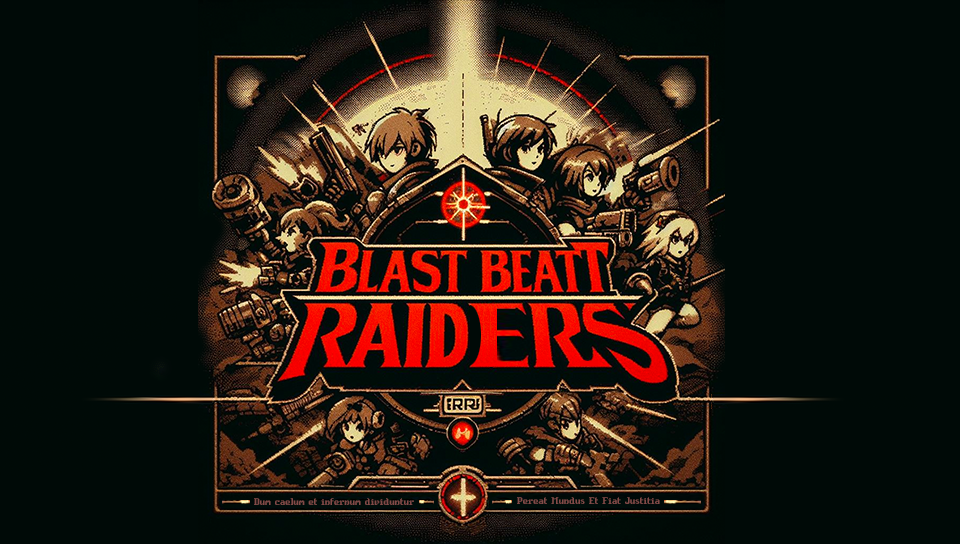

# BlastBEATT Raiders

*" — Dum caelum et infernum unum fiunt, regna pereant et mundus renascatur — "* 

---

## About
**BlastBEATT Raiders** is a dungeon crawler RPG for homebrew-enabled **Playstation Portable** consoles. It features design elements based off of the Game Boy Advance-era [Sting Entertainment (株式会社スティング)](https://en.wikipedia.org/wiki/Sting_Entertainment) titles, primarily [Rivera: The Promised Land](https://en.wikipedia.org/wiki/Riviera:_The_Promised_Land).

The project is intended to be a personal love letter to the studio's NTSC-localized games, and an excuse to *~~torture myself with~~* finally learn C.

## Story Synopsis (tbd)
The game is set in a post-apocalyptic world where the player must navigate through a series of dungeons to uncover the truth behind the world's destruction. The game features a unique combat system, a deep story, and retro-inspired graphics.

## Progress
-tba-

## License
This project is under a dual license of the GNU General Public License v3 (source code) and the CC BY 4.0 License (assets). See the appropriate `LICENSE` files for more information.

---

*As of current, this project does contain a number of AI generated assets. I will inevitably be working on replacing these with original, human-created assets. If you have any questions or concerns, or would like to contribute to eliminate these, please feel free to reach out to me.*